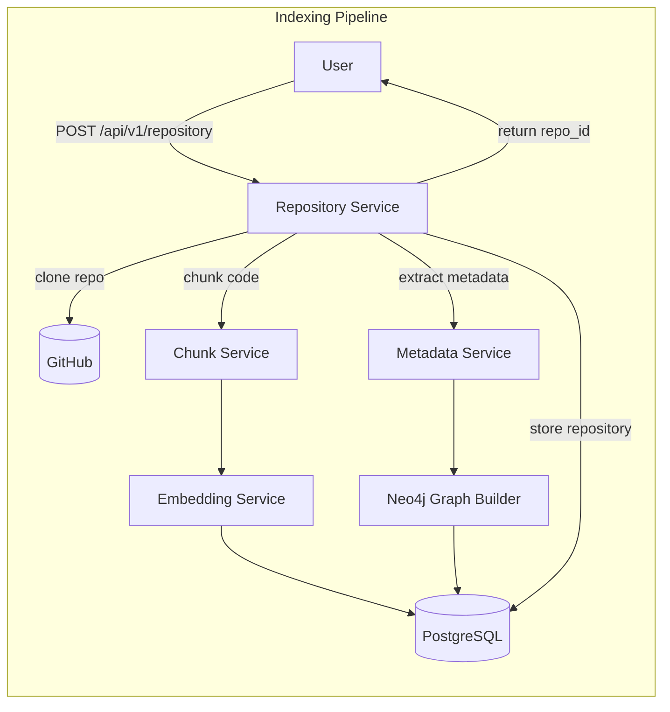
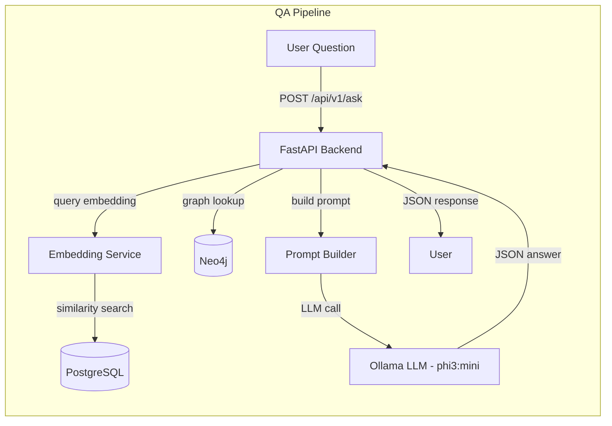

# Architecture - Repository Intelligence Backend

Technical reference for the internal design of the Repository Intelligence Backend: pipelines, project structure, RAG mechanics, prompt/JSON handling, and direct database queries.

> For installation and everyday usage, see the main [README.md](./README.md).

---

## Architecture Overview

### Indexing Pipeline



**Flow:**
1. Client `POST`s `/api/v1/repository` with `{"repo_url": "https://github.com/LaibaFirdouse/Repona"}`.
2. `RepositoryService.index_repository()` clones the repo to disk.
3. Extracts metadata (languages, summary, directory structure) via `metadata_service`.
4. Builds a **Neo4j graph** of code entities (`graph_service` creates `(:Repository)`, `(:Directory)`, `(:File)`, `(:Class)`, etc., with relationships like `(:Directory)-[:CONTAINS]->(:File)` and `(:File)-[:IMPORTS]->(:Module)`).
5. Chunks the source code using `chunk_service` (sliding window, e.g. 100 lines with 20-line overlap).
6. Generates embeddings for each chunk using `all-MiniLM-L6-v2` via `embedding_service`.
7. Stores chunks, embeddings, and metadata in PostgreSQL (`repositories`, `code_chunks`, etc.).
8. Returns HTTP 200 with `{"repository_id": "<UUID>"}`.

### QA Pipeline (RAG)



**Flow:**
1. Client `POST`s `/api/v1/ask` with `{"repository_id": "...", "question": "How is SidebarProvider implemented?"}`.
2. FastAPI calls `RepositoryQAService.answer_question()`.
3. Retrieves repository context: `RetrievalService` gets relevant code chunks, `GraphService` gets related graph nodes.
4. The query is embedded (via `all-MiniLM-L6-v2`) and a vector search finds the top-K chunks by cosine similarity in PostgreSQL.
5. Retrieved code snippets (plus metadata/graph context) are combined with the question into a single prompt.
6. A strict system prompt instructs the LLM to output JSON only.
7. The prompt is sent to Ollama (`phi3:mini`) via HTTP, with stop sequences (e.g. triple backticks) so the model halts after the JSON.
8. The backend parses the JSON answer (stripping code fences, extracting the first JSON object with `JSONDecoder.raw_decode`) and returns it to the user.

---

## Project Structure

```
backend/
├── app/
│   ├── api/                        # FastAPI route definitions
│   ├── core/                       # Core settings, logging, security
│   ├── crud/                       # DB CRUD operations
│   ├── db/                         # Database (SQLAlchemy) models & session
│   ├── models/                     # Pydantic models & schemas
│   ├── schemas/                    # Request/response schemas
│   ├── services/                   # Business logic services
│   │   ├── repository_service.py       # Clone & index repository
│   │   ├── retrieval_service.py        # Semantic search (Postgres) for QA
│   │   ├── chunk_service.py            # Code chunking utility
│   │   ├── embedding_service.py        # Embedding generation (all-MiniLM)
│   │   ├── graph_service.py            # Build Neo4j code graph
│   │   ├── repository_qa_service.py    # Orchestrate QA (build prompt, parse LLM)
│   │   └── metadata_service.py         # Extract repo metadata
│   ├── llm/
│   │   └── ollama_provider.py      # Call local Ollama API
│   └── main.py                     # FastAPI app (includes routers)
├── Dockerfile
├── docker-compose.yml
└── requirements.txt
```

### Module Descriptions

- **`repository_service.py`** - Handles `/api/v1/repository`. Clones the Git repo, invokes metadata and graph builders, splits code into chunks, calls `embedding_service`, and stores everything in PostgreSQL. Returns a generated `repository_id`.
- **`retrieval_service.py`** - Given a question and repository ID, computes a query vector and performs a cosine-similarity search in the `code_chunks` table to find the most relevant chunks.
- **`repository_qa_service.py`** - Handles `/api/v1/ask`. Loads retrieved code chunks and graph context, constructs the LLM prompt (system + user messages), calls `ollama_provider.generate()`, and parses the JSON answer.
- **`ollama_provider.py`** - Implements low-level HTTP calls to Ollama (`POST /api/generate` or `/api/chat`). Includes error handling, stop sequences, and debug logging.
- **`chunk_service.py`** - Splits large source files into overlapping chunks (e.g. 100 lines with 20-line overlap) for embedding.
- **`embedding_service.py`** - Uses HuggingFace transformers (`all-MiniLM-L6-v2`) to produce vector embeddings for code chunks and queries.
- **`graph_service.py`** - Scans the repository to create nodes (`Repository`, `Directory`, `File`, `Class`, `Function`, etc.) and relationships (`contains`, `imports`, `defines`, `depends`) in Neo4j.

---

## Retrieval-Augmented Generation (RAG) Pipeline

1. **Query Embedding** - The question is embedded using `all-MiniLM-L6-v2` (384-dim vectors).
2. **Similarity Search** - The vector is compared against stored code-chunk embeddings (cosine similarity); top-K chunks are retrieved from PostgreSQL.
3. **Graph Context** - Related entities from the Neo4j graph (classes, files, modules) may be fetched to enrich context.
4. **Prompt Construction** - The strict system prompt is prepended; the user prompt includes the question and only the retrieved context.
5. **LLM Generation** - The combined prompt is sent to Ollama, with stop sequences (e.g. `` ``` `` and line breaks) so the model terminates after the JSON.
6. **Answer Parsing** - The response is cleaned and parsed as JSON.

RAG ensures the LLM answers with grounded, up-to-date code information - an "open-book" approach to question-answering.

---

## Prompt Construction & JSON Parsing

### System Prompt (`repository_qa_service.py`)

The system message instructs the model to output exactly one JSON object and nothing else:

```python
# repository_qa_service.py
def build_system_prompt(self) -> str:
    return (
        "You are a repository question answering assistant.\n"
        "Return EXACTLY one valid JSON object.\n"
        "Do NOT wrap it in markdown or explain your answer.\n"
        "Do NOT add any text before or after the JSON.\n"
        "The first character of your response must be '{'.\n"
        "The last character must be '}'."
    )
```

### Sending to Ollama (`ollama_provider.py`)

A stop sequence prevents extra text after the JSON:

```python
# ollama_provider.py
payload = {
    "model": self.model,  # e.g. "phi3:mini"
    "prompt": combined_prompt,
    "stream": False,
    "options": {
        "stop": ["```"]  # Stop if model emits a markdown fence
    }
}
```

### Stripping Markdown Fences

If the model still wraps JSON in a markdown block, it's stripped manually before parsing:

```python
response_content = response_content.strip()
if response_content.startswith("```json"):
    response_content = response_content.removeprefix("```json").strip()
elif response_content.startswith("```"):
    response_content = response_content.removeprefix("```").strip()
if response_content.endswith("```"):
    response_content = response_content.removesuffix("```").strip()
```

### Robust JSON Decoding

Instead of `json.loads()` on the entire response (which fails if extra text follows the JSON), `JSONDecoder.raw_decode()` parses only the first JSON object in the string:

```python
from json import JSONDecoder

decoder = JSONDecoder()
answer_data, end_index = decoder.raw_decode(response_content)
```

This handles cases where the model tacks on additional text after the JSON, avoiding parse errors from extraneous output.

### Example JSON Answer Schema

Fields (Pydantic model): `answer` (string), `confidence` (string, e.g. `"high"`), `sources` (list of source identifiers), `graph_context_used` (bool).

```json
{
  "answer": "SidebarProvider is implemented in `components/ui/sidebar.tsx` and provides the state for the mobile sidebar via useSidebar.",
  "confidence": "high",
  "sources": ["components/ui/Sidebar.tsx"],
  "graph_context_used": true
}
```

---

## API Reference

| Method | Path | Description |
|---|---|---|
| `POST` | `/api/v1/repository` | Index a Git repository (body: repo URL) |
| `POST` | `/api/v1/ask` | Ask a natural-language question (body: `repo_id` + `question`) |

All request/response models are JSON. FastAPI provides schemas and example payloads in the Swagger UI.

---

## Database Models
### Neo4j (Cypher) 

### `Repository` (node)

| Property | Type |
|---|---|
| `id` | `str` |
| `url` | `str` |

### `File` (node)

| Property | Type |
|---|---|
| `repository_id` | `str` |
| `path` | `str` |
| `name` | `str` |
| `module` | `str` |
| `is_service` | `bool` |

### `Module` (node)

| Property | Type |
|---|---|
| `repository_id` | `str` |
| `name` | `str` |

### `Service` (node)

| Property | Type |
|---|---|
| `repository_id` | `str` |
| `path` | `str` |
| `name` | `str` |

### Relationships

| Relationship | From → To |
|---|---|
| `CONTAINS` | `Repository → File` |
| `CONTAINS` | `Repository → Module` |
| `CONTAINS` | `Module → File` |
| `IMPORTS` | `File → File` |
| `USES` | `Module → Module` |
| `IMPLEMENTED_IN` | `Service → File` |

Want me to add this as a "Neo4j Graph Schema" section in `ARCHITECTURE.md`, right after the Postgres tables?


### PostgreSQL (SQL)

### `repositories`

| Field | Type |
|---|---|
| `id` | `str` (UUID, primary key) |
| `repo_url` | `str` (unique) |
| `created_at` | `datetime` |
| `updated_at` | `datetime` |

### `code_chunks`

| Field | Type |
|---|---|
| `id` | `int` (primary key) |
| `repository_id` | `str` (FK → repositories.id) |
| `file_path` | `str` |
| `chunk_index` | `int` |
| `start_line` | `int` |
| `end_line` | `int` |
| `content` | `str` (text) |
| `embedding` | `list[float]` (JSON) |

### `analysis_reports`

| Field | Type |
|---|---|
| `id` | `str` (UUID, primary key) |
| `repository_id` | `str` (FK → repositories.id) |
| `status` | `str` |
| `file_count` | `int` |
| `directory_count` | `int` |
| `ignored_directories` | `list[str]` (JSON) |
| `technologies` | `list[dict[str, str]]` (JSON) |
| `directory_structure` | `list[dict]` (JSON) |
| `summary` | `dict` (JSON) |
| `token_usage` | `dict[str, int]` (JSON) |
| `created_at` | `datetime` |

---

## Debugging & Troubleshooting (Internals)

- **Timeouts / Performance** - Large prompts (hundreds of KB of code + metadata) can take time. Default HTTP timeout is 120s; increase to 300s+ during development. Use `phi3:mini` (smaller/faster) to verify the pipeline works. Logs showing prompt lengths and fetch times help diagnose bottlenecks.
- **Connection Issues** - If you see "Connection refused," ensure `OLLAMA_BASE_URL` is correct and Ollama is running (`ollama serve`). Quick test: `curl http://localhost:11434/api/chat` (should return a schema or error JSON).
- **Invalid / Empty JSON** - Inspect the raw response. Debug prints in `ollama_provider.py` after the HTTP call:

```python
raw_response = response.read().decode("utf-8")
print("="*30, "RAW HTTP RESPONSE", "="*30)
print(raw_response)
print("="*30, "PARSED PAYLOAD", "="*30)
payload_response = json.loads(raw_response)
print(payload_response)
content = payload_response.get("response", "")
print(f"Response field repr: {content!r}")
print(f"Done: {payload_response.get('done')}, Done reason: {payload_response.get('done_reason')}")
```

  This logs the entire HTTP body and parsed JSON fields (`response`, `done`, `done_reason`). If `response` is empty or the JSON lacks a `response` key, the log will help identify why (e.g. an immediate stop or error).

- **LLM Output** - Log the raw LLM text before parsing to see exactly what was generated.
- **Order of Fixes** - Implement the JSON decoding fix (`raw_decode`) first, then fence-stripping, then prompt adjustments, and finally stop sequences. This step-by-step approach isolates each issue.
- **Model Behavior** - If the LLM repeats or refuses to answer, adjust stop sequences or tighten the system prompt's JSON instructions.
- **Schema Errors** - If Pydantic raises validation errors on the JSON, inspect which field is malformed; ensure it matches the expected keys (`answer`/`confidence`/`sources`/...).


---
